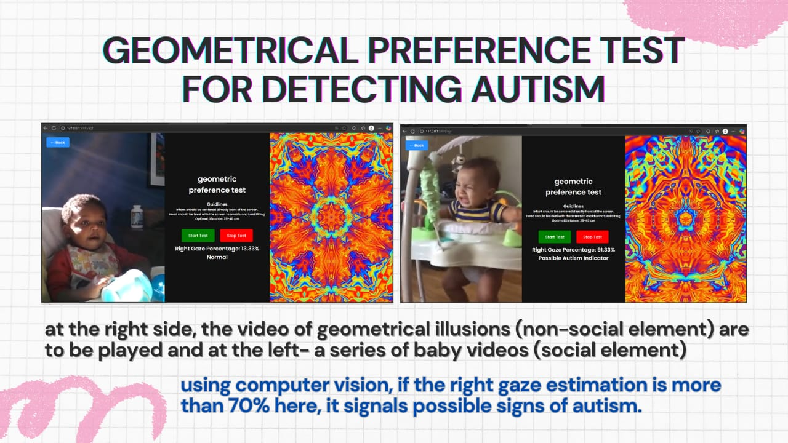
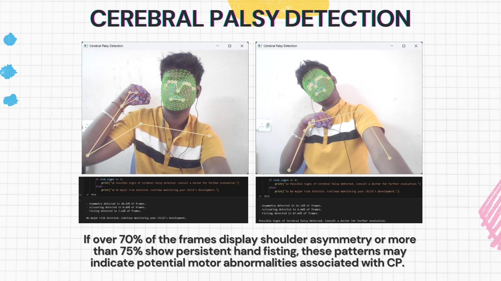
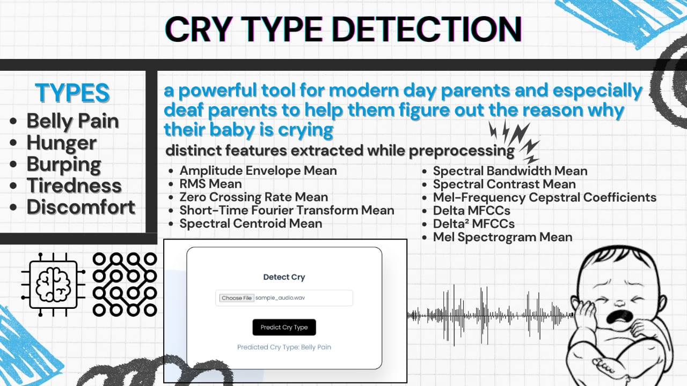

# Cryonics 
- beacuse every cry matters
### AI-Powered Infant Care & Cry Analysis System  

  
  

## Overview  
**Cryonics-Crux** is a **fully-fledged full-stack project** designed to assist **young parents** by leveraging **AI/ML** to analyze infant cries and provide real-time support. The system offers **cry-type detection, autism & cerebral palsy detection, and an interactive chatbot** for guidance.  

Additionally, the **Helping Hand** feature extends support to **underprivileged parents and NGOs** to help reduce **infant mortality rates**, with a **multi-lingual interface** for global accessibility.  

---

## Team  
### Project Leads:  
- **Shubham Mohanty** ([GitHub](https://github.com/shubudubu))  
- **Rahul Mallik** ([GitHub](https://github.com/rahul-mallik))  

---

## Key Features  
✅ **AI-Powered Cry Detection** - Identifies different types of baby cries (hunger, discomfort, pain, etc.)  
✅ **Autism & Cerebral Palsy Detection** - Early-stage AI-based diagnosis for better intervention  
✅ **Infant Chatbot** - AI-driven chatbot for real-time assistance and parenting tips  
✅ **Helping Hand** - Special feature for NGOs & underprivileged parents to aid in child care  
✅ **Multilingual Support** - Supports multiple languages for wider accessibility  

---

## Tech Stack  
- **Frontend:**  HTML, CSS, JS 
- **Backend:** Flask   
- **Machine Learning:** Librosa / Scikit-learn / Numpy & Pandas / Joblib / OpenCV / MediaPipe  
- **Database:** MongoDB   

---

## 📸 Screenshots (Coming Soon!)  
🔹 Infant Cry Detection Interface

🔹 AI Chatbot Assistance 

🔹 Helping Hand Dashboard

🔹 Geometrical Preference Test for ASD
 
)
🔹 Cerebral Palsy Detection
 
)
🔹 Cry Type Detection
 
🔹 Go through our website for more insigths
---
